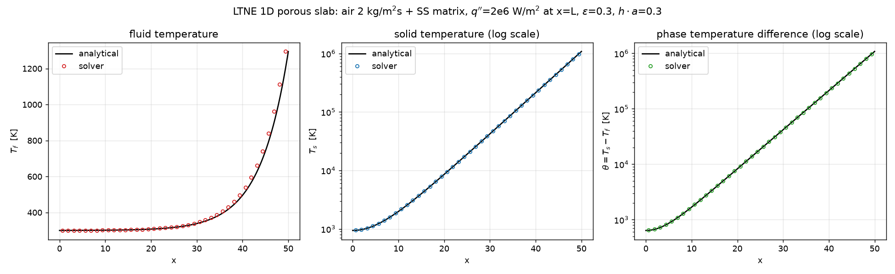

# LTNE 1D 多孔发汗冷却验证（forced convection through porous slab）

> 2026-10-04 | 非结构求解器 LTNE 双温度模型验证最后一项：1D 带对流的局部热非平衡问题，
> 与闭式解析解对比。此前 LTNE 仅做过静态冒烟（T_f≠T_s），本算例首次定量验证
> 相间交换源项、固相导热与壁面热流分配。

## 1. 算例设置

**物理场景**：空气冷却剂强制通过不锈钢多孔样品，下游端面（x=L）施加恒定热流
q″=2e6 W/m²。热量进入固相骨架、沿 x 向上游导热、经 h·a 交换给流体并被带出——
经典多孔发汗冷却（transpiration cooling）构型。

**网格**：`LNTE1D.cas`（Pointwise V18.2R2，用户提供于 /mnt/c/temp/LNTE1D.cas）
- 7093 节点 / 12160 wedge / 31504 面；x∈[0,50]，y,z∈[0,10]（网格长度单位按原样消费，
  面/体量纲量用 SI——同 grid_BC/unMesh.control 的准 SI 约定）
- x 向 41 节点均匀 dx=1.25；y/z 向 144 节点向对称壁面加密（0.00126~0.58）
- zone：2=fluid（多孔体区域）、4=symmetry、5=mass-flow-inlet(x=0, 304 tri)、
  6=pressure-outlet(x=50, 304 tri)。**无 wall zone** → 热流施加于出口端面（zone 6 tbc）

**边界条件**（ltne1d.control）：
| zone | 类型 | 值 |
|---|---|---|
| 5 | mass-flow-inlet | mdot=2 kg/(m²·s)，T_in=300 K（u_in=1.699 m/s） |
| 6 | pressure-outlet | p=0；兼作恒热流面 `tbc = 6 2 2.0e6`（Neumann q″） |
| 4 | symmetry | 绝热、滑移 |

**流体**：300 K 空气 ρ=1.177 kg/m³、μ=1.846e-5 Pa·s、cp=1005 J/(kg·K)、k_f=0.026 W/(m·K)

**多孔介质**：孔隙率 ε=0.3，SS304 不锈钢（k_s=16.2、cp_s=500、ρ_s=7900）；
Darcy 渗透率 1e-8 m²、无 Forchheimer；h_sf·a_sf=0.3 W/(m³·K)
——h·a 特意选小使相间交换长度 √(D/(h·a))=√(11.34/0.3)=6.15≈4.9·dx 可被网格分辨。

## 2. 解析解（控制文件头部含完整推导）

稳态 1D 双温度方程（流体轴向导热可略，Pe~1e6）：

```
G·cp·T_f' = h·a·(T_s - T_f)          流体能量
D·T_s''   = h·a·(T_s - T_f)          固体能量, D = (1-ε)k_s = 11.34
T_f(0)=T_in ; T_s'(0)=0 ; D·T_s'(L)=q_s
```

壁面热流按有效导热分数分配（Nield 式）：
q_s = q″·(1-ε)k_s/(εk_f+(1-ε)k_s)（固相占 99.93%），q_f 为其余。

特征根 λ± = [−b ± √(b²+4c)]/2（b=h·a/(G·cp)=1.492e-7，c=h·a/D=0.02646），
T_f' = A·e^{λ+x}+B·e^{λ−x}，B=−A(λ++b)/(λ−+b)，
A = (q_s/D)/[(1+λ+/b)(e^{λ+L}−e^{λ−L})]，T_s = T_f + G·cp·T_f'/(h·a)。

**总量守恒**：T_f(L)−T_in = q″/(G·cp) = 2e6/(2·1005) = 995.0 K（与 h·a 无关）。

## 3. 结果

SIMPLE 稳态，3343 次外迭代收敛（outer_tol=1e-6 三判据：质量、速度、温度），
`alpha_u=0.7, alpha_p=0.3, ppe_precond=ic0`。

### 3.1 流场（Darcy 平衡）
| 量 | 数值 | 理论 |
|---|---|---|
| 内部轴向速度 | ≈1.699 m/s（截面积均匀） | mdot/ρ=1.699 |
| max\|u\| | 1.768 m/s | 入口速度（数值边界层略高） |
| 入口-出口压差 | 5.17e5 Pa | μ_eff/perm·u·L=(1.846e-5/0.3)/1e-8·1.699·50=5.23e5 |
| mass-imbal（终值） | 1.8e-19（机器零） | — |

### 3.2 温度场 vs 解析解（plot_ltne.py 分层统计，41 层）
| 指标 | 数值 |
|---|---|
| 能量守恒 ΔT_f(L)=T_f,L−T_in | 995.02 K vs 995.02 K（**−0.001%**） |
| T_s 剖面最大/中位偏差（占总温升） | **0.074% / 0.014%** |
| T_f 剖面最大/中位偏差（占 995 K） | 9.7% / 0.198% |
| θ=T_s−T_f 动态范围 | ~800 → ~9.8e5 K（3.5 量级） |

T_f 最大偏差集中在出口陡峭段（x>45，指数增长模态衰减长度 6.15≈4.9dx，
一阶迎风+粗分辨率所致）；T_s 全程吻合。

### 3.3 结果图

(a) 流体温度（线性）；(b) 固体温度（对数）；(c) 两相温差 θ（对数）。
圆点=求解器，实线=解析解。

## 4. 复现

```bash
cd cases/ltne
../bin/uns_solver LNTE1D.cas ltne1d.control            # ~25 min
python3 plot_ltne.py LNTE1D.vtu ltne1d_profiles.png
```

回归（本次修复后重验）：
- `cases/natconv/porous_darcy/porous_Ra10`（全 Neumann PPE）**位级一致**（两次）
- porous_Ra10 np2 = **748 步与串行相同**（修复前 296 步——cell-zone 丢失、无 Darcy）
- LTNE np2 = **3343 步收敛，与串行同迭代数**，迭代历程逐步吻合（末位分区噪声）

## 5. 本次修复的求解器 bug（算例调试过程中暴露）

1. **PPE 钉死 cell 1 = 假质量汇**（核心 bug，串行+MPI）：
   存在压力 Dirichlet 面（POUTLET/FARFIELD）时 PPE 矩阵已非奇异，仍无条件钉死
   cell 1 → 该 cell 连续性方程被丢弃，成为永久假质量源/汇。本算例 cell 1 恰在
   入口第一层：60% 入口流量"消失"、内部流速仅 0.4·u_in、mass-imbal 卡死 4.4e-2、
   该 cell 温度爆炸（T~1e8）+ 倒流。修复：仅全 Neumann（封闭域）才钉死
   （`mod_uns_simple.f90:ppe_assembly`、`mod_uns_simple_mpi.f90:ppe_assembly_mpi`
   + has_pdir 的 MPI_LOR allreduce）。
2. **POUTLET 动量倒流削弱对角**：`ap += F` 在出口面倒流（F<0）时违反迎风原则、
   可使动量/PPE 矩阵不正定（纯流体算例 ICC0 非正主元 NaN 的成因之一）。改为
   max(F,0) 隐式 + min(F,0)·u_P 显式（`momentum_assembly`）。
3. **mass-flux 归一化**：flux_ref 未计入 massinlet uspeed（本算例 flux_ref 偏大
   22 倍），uscale 补入 `gb%uspeed`（6 处：串行/MPI×3 驱动）。
4. **MPI 本地 BC 空 zone**：METIS 将小 zone（304 面的入口/出口）全分给单个 rank 时，
   其他 rank 本地 build_bc 报 "no boundary faces" 而中止。`build_bc` 增加
   `allow_empty` 可选参（仅 MPI 本地调用传 .true.），空 zone 合法（面在别的 rank）。

**回归影响**：全 Neumann 路径（cavity 族）逐位不变；含出口算例的收敛解物理不变
（LTNE 本算例修复前后收敛于同一结果：同为 3343 次迭代、同场）。

## 6. 已知限制

- **纯流体 mdot-inlet + 出口**（无多孔阻力）在该网格上启动期发散：it=1 流场为零、
  动量对角仅粘性量级（~1e-5），速度修正 V/a_pc·∇p′ 放大 ~1e4 倍 → NaN。
  多孔/含阻力算例受 Darcy 对角保护不受影响。后续可选：入口渐启/瞬态启动。
- MPI np2 一致性：LTNE np2 与串行同为 3343 步收敛（§4）；Tmin 分区末位噪声
  （308.0 vs 300.1，位于分区界面 cell，量级 0.1K/陡峭梯度区）。

## 7. 结论

- LTNE 双温度模型定量验证通过：能量守恒精确（−0.001%），固相剖面 <0.1%，
  流相剖面中位 0.2%；相间交换 h·a(T_s−T_f)、固相导热 (1-ε)k_s∇T_s、
  Nield 壁面热流分配、固相入口绝热等实现与解析解一致。
- 调试过程中发现并修复 PPE 钉死、POUTLET 迎风、MPI 空 zone 三个真实 bug，
  全 Neumann 回归位级无影响。
