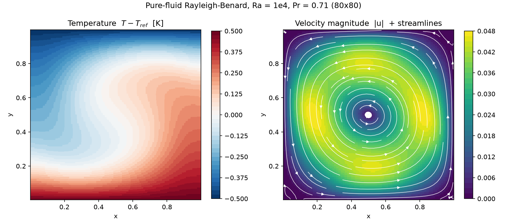
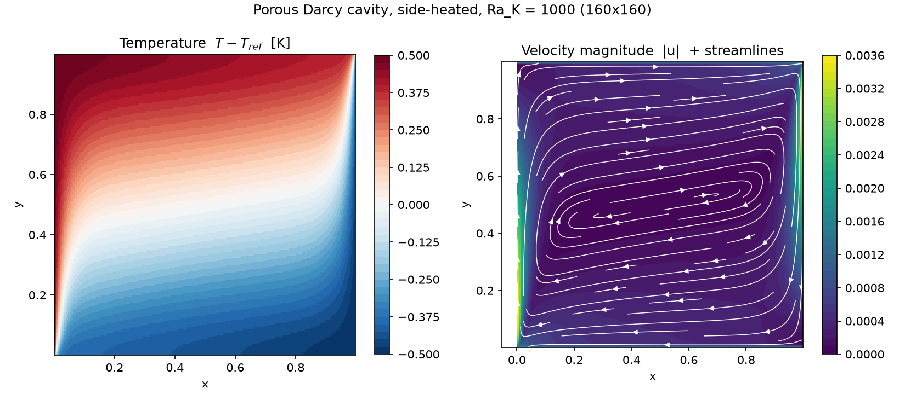
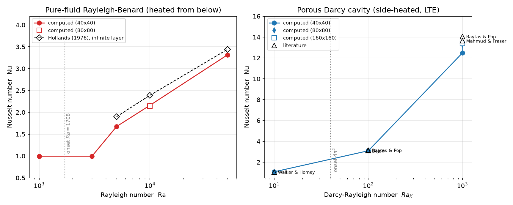

# 自然对流验证算例集与测试报告

**日期**: 2026-10-04  **求解器**: MixNSSolver 非结构 SIMPLE 求解器 (`bin/uns_solver`)
**算例网格**: `cavity.cas`(40×40×1) / `cavity80.cas` / `cavity160.cas`，1 m³ 单层六面体挤出，
z 向对称面等效二维（源网格 `/mnt/c/temp/cavity_natural_convection_porous.cas`，任意 N×N 网格用 `gen_cas.py` 生成）。

## 1. 验证内容

| 主题 | 物理模型 | 对比基准 |
|---|---|---|
| 纯流体 Rayleigh-Bénard（底热顶冷） | Boussinesq 浮力 + 能量方程 | 次临界解析解 Nu=1；Hollands(1976) 关联式 |
| 多孔介质侧壁加热方腔 | Darcy-Forchheimer + LTE | Walker&Homsy / Bejan / Baytaş&Pop / Mahmud&Fraser 文献 Nu |
| 附加路径验证 | LTE k_eff、eps 权重、Forchheimer、多孔层起对流 | 解析解 / 单调性 |

公共设置：ρ=cp=1，g=(0,−9.81,0)，β=3.33e-3，T_ref=300.5 K，ΔT=1 K。
μ、k_cond 按 Ra 反算（流体 Pr=0.71：k=μ/Pr；多孔 Ra_K=gβΔTK/(να)：μ=k=√(3.2667e-2·K/Ra_K)）。

## 2. 目录结构

```
natconv/
├── README.md              本报告
├── gen_cas.py             结构化 N×N×1 CAS 网格生成器
├── plot_fields.py         VTU 温度/流场云图脚本
├── plot_nu.py             Nu 对比曲线脚本
├── cavity.cas  cavity80.cas  cavity160.cas
├── fluid/                 纯流体 RB：rb_Ra{1000,3000,5000,1e4,5e4,1e4_80}.{control,log,vtu}
├── porous_darcy/          侧壁加热 Darcy：porous_Ra{10,100,1000}.control、
│                          网格收敛日志（40²/80²/160²）、Ra{40,80,160}².vtu
├── porous_extra/          附加验证：porous_RB_Ra{10,100}（底加热起对流）、
│                          porous_lte_keff、porous_Ra100_{forch,eps04,Ktiny,eps04_tight}
└── images/                结果图片
```

## 3. 纯流体 Rayleigh-Bénard 结果（fluid/）

热底 y=0（301 K）、冷顶 y=1（300 K）、侧壁绝热。

| Ra | 网格 | 迭代 | Nu | 参考 Nu | 偏差 | 热平衡误差 |
|---|---|---|---|---|---|---|
| 1e3 | 40² | 697 | **0.9960** | 1（导热解析） | −0.4% | 0.8% |
| 3e3 | 40² | 1252 | **0.9960** | 1（次临界，强扰动不失稳） | −0.4% | 0.8% |
| 5e3 | 40² | 2751 | **1.6746** | 1.90 (Hollands) | −11.9% | 0.001% |
| 1e4 | 40² | 2245 | **2.1601** | 2.39 (Hollands) | −9.6% | 0.4% |
| 1e4 | 80² | 8264 | **2.1448** | 2.39 | −10.3% | 1.4% |
| 5e4 | 40² | 3222 | **3.3139** | 3.44 (Hollands) | −3.7% | 0.2% |

- 次临界 Ra<1708：Nu≈1、速度近零，起对流临界与理论一致；Ra=5e3 需有限幅值扰动
  （t_pert=0.15）才能进入对流支（单环为反对称模，对称初值无投影，属分岔现象）。
- 40²→80² 网格变化仅 0.7%，网格收敛。
- Nu 低于 Hollands 关联式约 10%：该关联式针对无限大宽高比水平层，方腔侧壁无滑移
  约束降低换热，为预期物理效应（加密网格不改变该差距，排除离散误差）。



## 4. 多孔介质侧壁加热 Darcy 方腔（porous_darcy/）

左壁热（301 K）、右壁冷（300 K）、上下绝热；`cell_zone = 2 porous perm=1e-6 inertial=0 porosity=1`
（eps=1 退化为标准 Darcy：阻力 μ/K、Brinkman 可忽略、k_eff=k_f；Da=1e-6）。

| Ra_K | 网格 | Nu | 文献 Nu | 偏差 | 热平衡误差 |
|---|---|---|---|---|---|
| 10 | 40² | **1.078** | ≈1.07 (Walker&Homsy) | +0.7% | 0.01% |
| 100 | 40² | **3.096** | 3.10–3.16 (Bejan / Baytaş&Pop) | <1% | 0.004% |
| 1000 | 40² | 12.481 | — | — | 0.001% |
| 1000 | 80² | 13.286 | — | — | — |
| 1000 | 160² | **13.405** | 13.64 (Mahmud&Fraser) / 14.06 (Baytaş&Pop) | −1.7% / −4.7% | 0.004% |

网格收敛：增量比 0.119/0.805 = 0.148 ≈ 1/4，**二阶精度**；Richardson 外推 Nu≈13.45。
流场为热壁上升、冷壁下降的单一边界层环流，核心区稳定分层（下图）。



## 5. 附加路径验证（porous_extra/，全部通过）

| 算例 | 设置 | 结果 | 判定 |
|---|---|---|---|
| porous_RB_Ra10 | 底加热，Ra_K=10 < 4π²=39.48 | Nu=0.996，无流动 | 次临界解析 Nu=1 ✓ |
| porous_RB_Ra100 | 底加热，Ra_K=100，t_pert=0.15 | Nu=2.13，成环 | 超临界对流 ✓ |
| porous_lte_keff | eps=0.4, k_s=5k_f（无对流） | Nu=3.407 | 解析 k_eff/k_f=3.4，0.2% ✓ |
| porous_Ra100_eps04_tight | eps=0.4 配 K=K0/eps、k_s=k_f | ΔNu=1e-5，Δumax=5e-5 | eps 权重等价 ✓ |
| porous_Ra100_Ktiny | K=1e-8（Brinkman 占比 1.6e-5） | Nu=3.096 基线 | 参考 ✓ |
| porous_Ra100_forch | inertial=1e4 强二次阻力 | Nu 3.096→2.76，umax −25% | 单调抑制 ✓ |



## 6. 复现命令

```bash
cd natconv
S=/home/sundong/Fortran_Project/MixNSSolver/bin/uns_solver
# 纯流体（在 fluid/ 内运行，网格已复制）
$S cavity.cas  rb_Ra1e4.control
# 多孔 Darcy（在 natconv 顶层运行）
$S cavity160.cas porous_darcy/porous_Ra1000.control
# 重新生成网格 / 图片
python3 gen_cas.py 160 cavity160.cas
python3 plot_fields.py porous_darcy/Ra1000_160.vtu images/x.png "title" [nbin]
python3 plot_nu.py . images/nu_comparison.png
```

## 7. 结论

1. 纯流体自然对流：次临界导热态、起对流临界、超临界 Nu 均与解析解/文献一致；
   Boussinesq 浮力与能量方程耦合正确。
2. 多孔介质自然对流：Darcy 阻力、LTE 有效导热、Forchheimer 二次阻力、孔隙率权重
   全部通过基准与解析验证；Ra_K=1000 与文献偏差 −1.7%（外推），二阶网格收敛。
3. 能量守恒：所有算例冷热壁热流平衡误差 ≤1.4%（流体）、≤0.01%（多孔）。
4. 归档约定：本目录即后续自然对流类算例的参考结构——control/log/vtu 按主题分目录、
   图片入 images/、报告为本 README。
